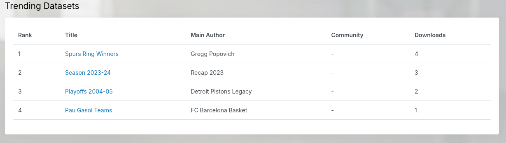
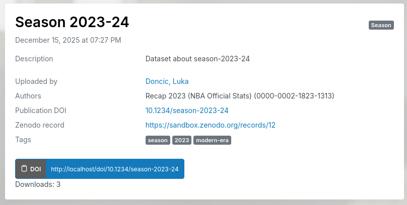
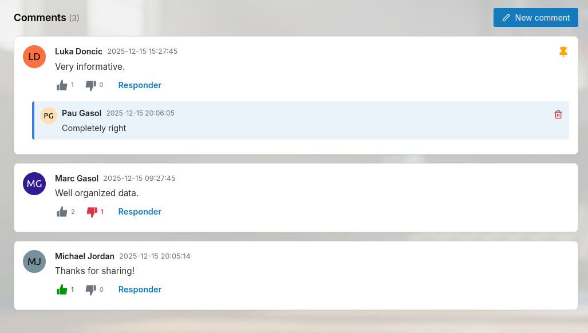
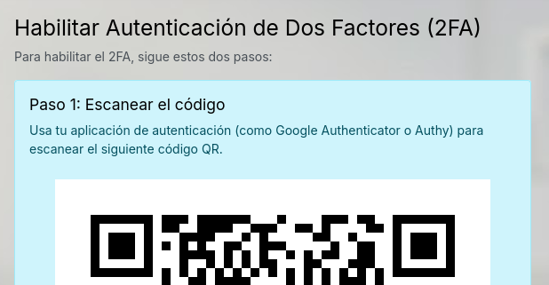
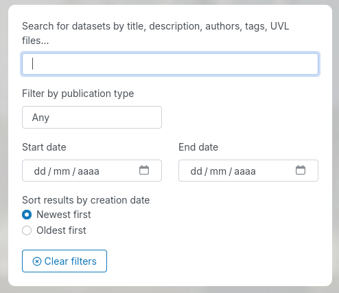
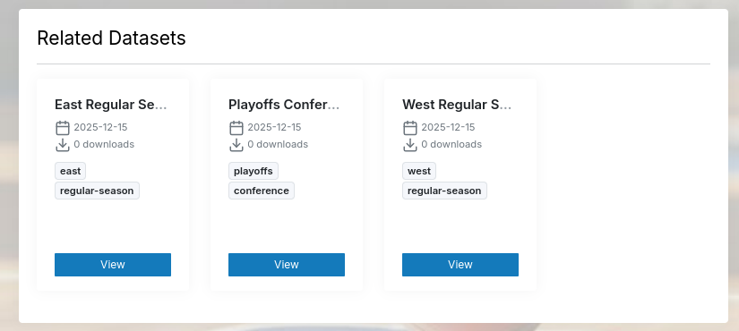

El documento del proyecto debe ser un documento que sintetice los aspectos del proyecto elegido para su desarrollo con respecto a los temas vistos en clases. 

Debe tener claramente identificados los nombres y apellidos de cada componente, grupo al que pertenecen (1, 2, o 3 mañana o tarde), curso académico, nombre del proyecto (seguir la política de nombres). Use este [[modelo de portada]] para el documento del proyecto y alójelo en su repositorio o en otro sitio accesible y que tenga posibilidad de verse el último momento de edicación. Puede usar el repositorio del proyecto usando para ello el lenguaje de [markdown](https://guides.github.com/features/mastering-markdown/) que ofrece github. En todo caso, debe ser un documento elaborado en formato [wiki]. 

Será un documento presentado de manera profesional guardando la forma en los estilos y contenidos y con el máximo nivel de rigor académico y profesional.

Tenga en cuenta los siguientes aspectos: 

* Siempre diferencie claramente las secciones y subsecciones y para ello use etiquetas de encabezado como las que se disponen en los lenguajes tipo _markdown_

# Apartados del documento 

El documento del proyecto tendrá (al menos) que sintetizar los siguientes apartados:

# 1. Indicadores del proyecto

(_debe dejar enlaces a evidencias que permitan de una forma sencilla analizar estos indicadores, con gráficas y/o con enlaces_)

Miembro del equipo  | Horas | Commits | LoC | Test | Issues | Work Item| Dificultad
------------- | ------------- | ------------- | ------------- | ------------- | ------------- |  ------------- |  ------------- | 
[Basallote Braza, David](https://github.com/orgs/DavidBBSA) | HH | XX | YY | ZZ | II | Trending datasets | H/M/L |
[Chaves Cumbreras, David](https://github.com/davchacum) | HH | XX | YY | ZZ | II | Download counter for datasets | H/M/L |
[Gago Vázquez, Francisco](https://github.com/frangago71) | HH | XX | YY | ZZ | II | Comments on datasets | H/M/L |
[González Vázquez, Guillermo](https://github.com/guigonvaz) | HH | XX | YY | ZZ | II | Two-factor authentication (2FA) | H/M/L |
[Herrera Luján, Marco Antonio](https://github.com/Marco2026) | HH | XX | YY | ZZ | II | Advanced dataset search | H/M/L |
[Rodríguez Muñoz, Rafael](https://github.com/rafaelroodrgz) | HH | XX | YY | ZZ | II | Automatic dataset recommendations | H/M/L |


[Apellidos, nombre](https://github.com/nombredeusuariodegithub) | HH | XX | YY | ZZ | II | Descripción breve | H/M/L |
**TOTAL** | tHH  | tXX | tYY | tZZ | tII | Descripción breve | H (X)/M(Y)/L(Z) |

La tabla contiene la información de cada miembro del proyecto y el total de la siguiente forma: 
  * Horas: número de horas empleadas en el proyecto
  * Commits: solo contar los commits hechos por miembros del equipo, no lo commits previos
  * LoC (líneas de código): solo contar las líneas producidas por el equipo y no las que ya existían o las que se producen al incluir código de terceros
  * Test: solo contar los test realizados por el equipo nuevos
  * Issues: solo contar las issues gestionadas dentro del proyecto y que hayan sido gestionadas por el equipo
  * Work Item: principal WI del que se ha hecho cargo el miembro del proyecto
  * Dificultad: señalar el grado de dificultad en cada caso. Además, en los totales, poner cuántos se han hecho de cada grado de dificultad entre paréntesis. 

# 2. Integración con otros equipos
No aplica, nuestro proyecto es individual.

# 3. Resumen ejecutivo 
Este trabajo, realizado para la asignatura de Evolución y Gestión de la Configuración (EGC), presenta una evolución y adaptación significativa de UVLHub. Hemos tomado como base este repositorio, originalmente diseñado para la gestión de Feature Models y archivos .uvl, y lo hemos modificado para aplicarlo a un dominio totalmente diferente: la gestión de datos y estadísticas de la NBA. El objetivo ha sido demostrar la flexibilidad de la arquitectura original reutilizándola para otro contexto de compartición de documentos, a la vez que enriquecemos la plataforma mejorando el login y la búsqueda de datasets y añadiendo nuevas funcionalidades, como la pantalla de trending datasets o el módulo de comentarios para fomentar el debate entre los aficionados.

El sistema base está construido sobre Flask (Python). Siguiendo la metodología de trabajo establecida en la asignatura, hemos mantenido la arquitectura modular del proyecto para integrar las nuevas funcionalidades y el cambio de dominio sin afectar a la estabilidad del sistema. En esta línea, hemos usado Rosemary, la herramienta de línea de comandos (CLI) nativa de este ecosistema. Su utilización nos ha permitido generar el esqueleto del código (rutas, servicios y repositorios) alineándonos con los estándares del proyecto base, lo que ha facilitado enormemente la organización de carpetas y la configuración inicial.

A nivel funcional, la transformación de la plataforma ha sido total. Hemos implementado listas de tendencias (Trending Datasets), recomendaciones automáticas de datasets y filtros de búsqueda avanzada. Además, hemos un nuevo sistema de comentarios. Paralelamente, hemos elevado la complejidad técnica y la seguridad del sistema integrando Autenticación en Dos Pasos (2FA) y desarrollando herramientas críticas de infraestructura como Fakenodo —un simulador local de Zenodo para eliminar dependencias externas—, además de añadir métricas como contadores de descargas y automatizar el aseguramiento de la calidad mediante flujos de trabajo de integración y despliegue continuo (CI/CD).

En el Frontend (desarrollado con Jinja2 y Bootstrap), el trabajo se ha materializado en la creación de múltiples interfaces nuevas para dar soporte a las funcionalidades añadidas. Concretamente, hemos diseñado y desarrollado la pantalla de comentarios, la pantalla de Trending Datasets, la sección de búsqueda avanzada, el apartado de datasets recomendados y las vistas necesarias para la configuración y validación del doble factor de autenticación (2FA), gestionando toda la estructura visual y la presentación de los datos.

Uno de los puntos fuertes del trabajo ha sido la flexibilidad en la gestión del entorno de desarrollo. No nos hemos limitado a una única forma de despliegue, sino que hemos configurado el proyecto para que sea completamente funcional en tres escenarios distintos: mediante contenedores usando Docker y Docker Compose, utilizando virtualización gracias a Vagrant, y también en modo local nativo mediante flask run. Esta versatilidad garantiza que la aplicación pueda desplegarse y funcionar correctamente independientemente de la infraestructura o las preferencias del desarrollador.

Por último, la calidad del software se ha garantizado mediante una estrategia de testing integral. Hemos utilizado pytest para ejecutar una batería de tests unitarios y de integración, asegurando la corrección de la lógica interna y la comunicación entre módulos. Para la validación de la interfaz y los flujos de usuario completos (end-to-end), hemos implementado pruebas automatizadas con Selenium, e incluso hemos realizado pruebas de carga y rendimiento del servidor utilizando Locust. 

En definitiva, hemos cogido un proyecto complejo y lo hemos evolucionado con éxito hacia NBAHub, aplicando herramientas de gestión de configuración y estrategias de despliegue flexibles para mantener el control sobre el desarrollo. El resultado es una plataforma transformada que integra funcionalidades sociales y de descubrimiento, cumpliendo con los objetivos planteados.

# 4. Descripción del sistema (1.500 palabras aproximadamente)
Se explicará el sistema desarrollado desde un punto de vista funcional y arquitectónico. Se hará una descripción tanto funcional como técnica de sus componentes y su relación con el resto de subsistemas. Habrá una sección que enumere explícitamente cuáles son los cambios que se han desarrollado para el proyecto.

Este documento describe el sistema desarrollado en el repositorio EGC-G2-M/nba-hub, un proyecto diseñado para proporcionar una plataforma centralizada para la consulta y gestión de información relevante de la NBA (National Basketball Association). El sistema aborda las necesidades de usuarios interesados en acceder a estadísticas, resultados y datos de jugadores y equipos de manera eficiente.
## 4.1. Perspectiva Funcional del Sistema
Desde un punto de vista funcional, el sistema se enfoca en la presentación y la interacción con la información, actuando como un punto de acceso a diversos datos del mundo del baloncesto. Las funcionalidades básicas han sido heredadas de uvlhub, y nuestro equipo ha añadido las siguientes funcionalidades, que se indicaban en los work items del repositorio de uvlhub: 

| Issue | Funcionalidad | Descripción | Interfaz Visual |
| :--- | :--- | :--- | :--- |
| https://github.com/EGC-G2-M/nba-hub/issues/8 | **Trending datasets** | El sistema observa el conteo de descargas y visualiza en la sección Trending datasets aquellos datasets con mayor popularidad en la comunidad. |  |
| https://github.com/EGC-G2-M/nba-hub/issues/6 | **Downloader counter for datasets** | Añade un contador de descargas en la página principal del dataset, lo que facilita la funcionalidad de Trending datasets. |  |
| https://github.com/EGC-G2-M/nba-hub/issues/5 | **Comments on datasets** | El sistema permite a los usuarios añadir comentarios a los datasets, creando hilos de conversación para debatir sobre las estadísticas publicadas. También es posible votar like/dislike en los comentarios y el propietario del dataset puede fijar los comentarios.|  |
| https://github.com/EGC-G2-M/nba-hub/issues/9 | **Two-factor authentication (2FA)** | Añade una capa extra de seguridad al inicio de sesión, requiriendo un código temporal de doble autenticación. |  |
| https://github.com/EGC-G2-M/nba-hub/issues/7| **Advanced dataset search** | Permite buscar información específica (jugadores, etiquetas, temporadas) a través de un motor de búsqueda intuitivo, facilitando la localización precisa de datasets. |  |
| https://github.com/EGC-G2-M/nba-hub/issues/10 | **Automatic dataset recommendations** | El sistema analiza las etiquetas del dataset actual para sugerir automáticamente al usuario otros datasets relacionados que podrían interesarle. |  |

## 4.2. Arquitectura del sistema
El sistema implementa una arquitectura Cliente-Servidor, estructurada bajo un patrón MVC (Modelo-Vista-Controlador) La arquitectura puede dividirse conceptualmente en tres capas principales:

- Capa de Presentación (Frontend):
        Responsable de la interfaz de usuario (UI/UX) y de la interacción directa con el usuario final. Transmite las peticiones al backend y renderiza los datos recibidos. Interactúa directamente con la Capa de Aplicación a través de la API.
- Capa de Aplicación (Backend/API):
        Contiene la lógica de negocio principal del sistema. Recibe las peticiones del frontend, procesa los datos, realiza la validación y llama a la capa de datos para recuperar o manipular la información. Se comunica con la Capa de Presentación y con la Capa de Datos.
- Capa de Datos:
        Almacena, gestiona y recupera toda la información persistente, incluyendo estadísticas, metadatos de partidos, perfiles, etc. Es accedida únicamente por la Capa de Aplicación.

## 4.3. Descripción Técnica de los Componentes y Subsistemas

# 5. Visión global del proceso de desarrollo
El desarrollo de NBAHub se ha llevado a cabo siguiendo un enfoque iterativo e incremental, adaptando las metodologías ágiles al contexto académico y organizativo de un equipo de estudiantes. Lejos de imponer un marco rígido como Scrum, que requiere roles estrictos y eventos temporales fijos, hemos optado por una metodología de trabajo colaborativa y flexible, centrada en la entrega continua de valor y la gestión visual de tareas.

Para organizar el trabajo del equipo, hemos utilizado GitHub Projects como herramienta central de gestión. Hemos implementado un tablero tipo Kanban donde las tareas fluyen a través de diferentes estados (Todo, In Progress, Done). La comunicación se ha mantenido fluida mediante reuniones, convocadas según la necesidad del proyecto para desbloquear problemas técnicos o planificar las siguientes funcionalidades a desarrollar.

## 5.1. Control de versiones y estrategia de ramas 

El control de versiones ha sido un pilar fundamental para evitar conflictos y mantener la integridad del código fuente. Hemos utilizado Git como sistema de control de versiones y GitHub como plataforma de alojamiento remoto.

Para organizar el flujo de trabajo, hemos seguido la estrategia sugerida por la asignatura, EGCFLOW. Las ramas principales que estructuran nuestro repositorio son:

    main: Representa la versión de producción estable. Todo el código que llega a esta rama ha sido probado y se considera listo para ser desplegado o entregado.

    trunk: Actúa como la rama de integración principal. Es el punto de encuentro donde convergen los desarrollos de todos los miembros del equipo. Aquí se resuelven los conflictos de integración antes de promocionar el código a producción.

Paralelamente, utilizamos ramas temporales para el trabajo diario:

    feature/<nombre-funcionalidad>: Cada nueva funcionalidad se desarrolla en su propia rama aislada, creada a partir de trunk. Esto permite que varios desarrolladores trabajen simultáneamente sin pisarse el código.

    bugfix/<descripcion-error>: Ramas destinadas a la corrección rápida de errores detectados en el sistema.

## 5.2. Gestión del entorno y dependencias

Dado que el proyecto se basa en un fork del repositorio UVLHub en GitHub, no hemos creado el entorno de trabajo desde cero. Nuestra labor se ha centrado en comprender y respetar la arquitectura que ya traía el código original para integrar nuestras nuevas funcionalidades sin alterar el funcionamiento base.

Nuestra estrategia de adaptación se resume en tres puntos:

    Estructura heredada: El repositorio original incluye una herramienta llamada Rosemary para gestionar el código. Nosotros la hemos utilizado para crear los nuevos módulos. De esta forma, Rosemary genera automáticamente los archivos y carpetas siguiendo el estándar del proyecto, garantizando que nuestro código nuevo sea indistinguible en estructura del código original.

    Control de librerías: Al hacer el fork, heredamos un archivo requirements.txt con versiones específicas de las librerías. Hemos mantenido estas versiones intactas para evitar incompatibilidades.

    Infraestructura: El proyecto descargado venía preparado para ejecutarse en Docker. Hemos aprovechado los archivos de configuración de Docker ya existentes, realizando solo los ajustes mínimos necesarios para integrar los nuevos servicios dentro de esta infraestructura preexistente. En cambio, la implementación con Vagrant se realizó completamente desde cero. Nuestro trabajo consistió en crear todos los archivos de configuración necesarios (como el Vagrantfile y scripts bootstrap.sh) para poder levantar y gestionar toda la infraestructura del proyecto utilizando Vagrant.

## 5.3 Arquitectura del sistema
NBAHub es una aplicación web basada en el patrón Modelo-Vista-Controlador (MVC), construida sobre Python y Flask. La arquitectura es modular gracias al uso de Blueprints. Esto significa que cada parte de la web (Autenticación, Datasets, Comentarios...) funciona como un mini-paquete independiente con sus propias rutas y modelos, lo que facilita mucho el mantenimiento.

    Backend: Flask gestiona la lógica y SQLAlchemy maneja la base de datos MariaDB.
    Frontend: Usamos Jinja2 para renderizar el HTML en el servidor y Bootstrap para el diseño visual, adaptado ahora a la estética de la NBA.

## 5.4 Aseguramiento de calidad
Hemos implementado una batería de pruebas con pytest, cubrimos desde tests unitarios (lógica interna) hasta pruebas de integración (rutas y base de datos). También hacemos pruebas End-to-End con Selenium para simular a un usuario real navegando por la web.

# 6. Entorno de desarrollo
Para garantizar la consistencia y flexibilidad durante el ciclo de vida del desarrollo de la aplicación, el equipo de trabajo ha establecido tres entornos distintos, todos ellos basados en **Ubuntu (versión 22.04 LTS o superior)** y usando Visual Studio Code como IDE. Recordamos que la gestión del código fuente se realiza independientemente del entorno de desarrollo seleccionado (Local, Docker o Virtualizado), el paso inicial común para todos los integrantes es la clonar el repositorio oficial del proyecto: ```git clone https://github.com/EGC-G2-M/nba-hub```

## 6.1. Entorno 1: Desarrollo Local (Nativo)
Este entorno implica la instalación directa de las dependencias en el sistema operativo anfitrión.

### 6.1.A Requisitos del Sistema y Base de Datos
El proyecto requiere **Python 3.12** y el sistema gestor de base de datos **MariaDB (versión 10.11.13)**.
**Instalación de MariaDB**: Se procede a la instalación y arranque del servicio mediante los siguientes comandos: 
```
sudo apt install mariadb-server -y
sudo systemctl start mariadb
```
Posteriormente, se ejecuta el script de seguridad ```sudo mysql_secure_installation```. Para asegurar la instalación correctamente, se deben introducir las siguientes respuestas exactas durante el proceso interactivo:
```
Enter current password for root (enter for none): (Pulse Enter)
Switch to unix_socket authentication [Y/n]: y
Change the root password? [Y/n]: y
    - New password: nbahubdb_root_password
    - Re-enter new password: nbahubdb_root_password
Remove anonymous users? [Y/n]: y
Disallow root login remotely? [Y/n]: y
Remove test database and access to it? [Y/n]: y
Reload privilege tables now? [Y/n] : y
```

**Configuración del Esquema y Usuarios**: Una vez asegurado el servicio, se accede a la consola de MariaDB (```sudo mysql -u root -p```) con la contraseña ```nbahubdb_root_password``` para la creación de las bases de datos y el usuario específico de la aplicación:
```
CREATE DATABASE nbahubdb;
CREATE DATABASE nbahubdb_test;
CREATE USER 'nbahubdb_user'@'localhost' IDENTIFIED BY 'nbahubdb_password';
GRANT ALL PRIVILEGES ON nbahubdb.* TO 'nbahubdb_user'@'localhost';
GRANT ALL PRIVILEGES ON nbahubdb_test.* TO 'nbahubdb_user'@'localhost';
FLUSH PRIVILEGES;
EXIT;
```
### 6.1.B Configuración del Entorno Virtual y Dependencias
Para aislar las librerías del proyecto, se utiliza el módulo ```venv``` de Python. El procedimiento de configuración incluye la definición de variables de entorno y la instalación de dependencias.
- **1. Variables de Entorno:** Se duplica el fichero de ejemplo para crear la configuración local y se configura el fichero ```.moduleignore``` para excluir el módulo de webhook en desarrollo:
```
cp .env.local.example .env
echo "webhook" > .moduleignore
```
-  **2. Creación del Entorno Virtual:**
```
sudo apt install python3.12-venv
python3.12 -m venv venv
source venv/bin/activate
```
-  **3. Instalación de Librerías:** Se actualiza el gestor de paquetes pip, se instalan los requerimientos listados y se configura Rosemary en modo editable:
```
pip install --upgrade pip
pip install -r requirements.txt
pip install -e ./
```
### 6.1.C Migraciones y Ejecución
Finalmente, se inicializa la estructura de la base de datos y se puebla con datos de prueba (seeding). Una vez finalizado, se lanza el servidor de desarrollo en modo debug.
```
# Migración y Seeding
flask db upgrade
rosemary db:seed

# Ejecución del servidor
flask run --host=0.0.0.0 --reload --debug
```
## 6.2. Entorno 2: Contenedorización con Docker
Como alternativa al desarrollo local nativo, se ha implementado un entorno basado en contenedores.
### 6.2.A Requisitos y Configuración Inicial
El prerrequisito fundamental para este entorno es disponer del motor de Docker instalado (versión 29.1.x o superior) junto con el plugin de Docker Compose.

Previo al despliegue, se deben establecer las variables de entorno específicas para la orquestación de contenedores, duplicando el archivo de plantilla proporcionado en el repositorio: ```cp .env.docker.example .env```
### 6.2.B Despliegue de Servicios
El levantamiento de la infraestructura se realiza mediante Docker Compose, utilizando un fichero de definición específico para el entorno de desarrollo (docker-compose.dev.yml). El siguiente comando construye las imágenes necesarias y levanta los contenedores en segundo plano (detached mode):
```
docker compose -f docker/docker-compose.dev.yml up -d
```
Este comando orquesta automáticamente la creación de la red interna, el volumen de la base de datos y el contenedor de la aplicación Flask.

### 6.2.C Integración con el IDE (DevContainers)
Una vez que los servicios están activos, se utiliza la paleta de comandos del editor para ejecutar la acción: ```Reopen in Container```.
Esta acción permite que el editor de código se conecte directamente al contenedor en ejecución, utilizando el entorno de Python y las herramientas instaladas dentro de él, asegurando que el entorno de escritura de código sea idéntico al de ejecución.

## 6.3 Entorno 3: Virtualización con Vagrant y VirtualBox
Como tercera vía, se ha implementado un entorno basado en Infraestructura como Código (IaC) utilizando virtualización completa. Este enfoque permite desplegar una máquina virtual (VM) que replica exactamente el sistema operativo y la configuración de producción, independientemente del sistema operativo anfitrión del desarrollador (Windows, macOS o Linux).
### 6.3.A Requisitos de Virtualización
Para orquestar este entorno, es necesario disponer de las siguientes herramientas de virtualización:
    Vagrant: Versión 2.4.x o superior (gestor de entornos).
    VirtualBox: Versión 7.0.x o superior (hipervisor).
### 6.3.B Provisionamiento y Despliegue
Al igual que en los entornos anteriores, se debe definir el entorno copiando la plantilla específica para Vagrant: ```cp ./.env.vagrant.example .env```. Para levantar la máquina se ejecuta el siguiente comando en la raíz del proyecto: ```.vagrant up```.

# 7 Ejercicio de propuesta de cambio
Se presentará un ejercicio con una propuesta concreta de cambio en la que a partir de un cambio que se requiera, se expliquen paso por paso (incluyendo comandos y uso de herramientas) lo que hay que hacer para realizar dicho cambio. Debe ser un ejercicio ilustrativo de todo el proceso de evolución y gestión de la configuración del proyecto. 

## 7.1. Propuesta de Flujo de Trabajo (Workflow) para Cambios

El siguiente procedimiento describe el ciclo de vida de una modificación en el código, desde la definición de la tarea hasta su integración en las ramas principales.

### OBJETIVO
Cambiar el color de nba-hub.

### PASO 1. Gestión de la Incidencia (Issue)
Se debe crear una *issue* en GitHub utilizando la plantilla predefinida para asegurar que toda la información necesaria quede registrada.

* **Acción:** Ir a la pestaña "Issues" en GitHub > "New Issue" > Seleccionar plantilla.


### PASO 2. Preparación del Entorno Local
Crear una nueva rama local para aislar los cambios.

```bash
git checkout -b prueba
```
### PASO 3. Vinculación con el Repositorio Remoto
Subir la rama al repositorio remoto para establecer el seguimiento (tracking).

```bash
git push -u origin prueba
```

### PASO 4. Desarrollo y Confirmación de Cambios (Commit)
Una vez realizados los cambios en el código, se procede al stage y al commit. Es obligatorio utilizar la plantilla de commit del proyecto.

```bash
git add --all

git config commit.template .github/COMMIT_TEMPLATE/commit_template.txt

git commit
```


### PASO 5. Sincronización de Cambios (Push)
Subir los cambios confirmados a la rama remota.

```bash
git push
```

### PASO 6. Integración en Trunk (Entorno de Desarrollo/Pruebas)
Fusionar los cambios en la rama de integración (trunk) trayendo primero los últimos cambios remotos para evitar conflictos.

```bash
git checkout trunk

git pull origin trunk

git merge --no-ff prueba

git push origin trunk
```

### PASO 7. Despliegue a Producción (Main)
Finalmente, integrar los cambios validados desde trunk hacia la rama principal (main).

```bash
git checkout main

git pull origin main

git merge --no-ff trunk

git push origin main
```

# 8. Conclusiones y trabajo futuro
Se enunciarán algunas conclusiones y se presentará un apartado sobre las mejoras que se proponen para el futuro (curso siguiente) y que no han sido desarrolladas en el sistema que se entrega
